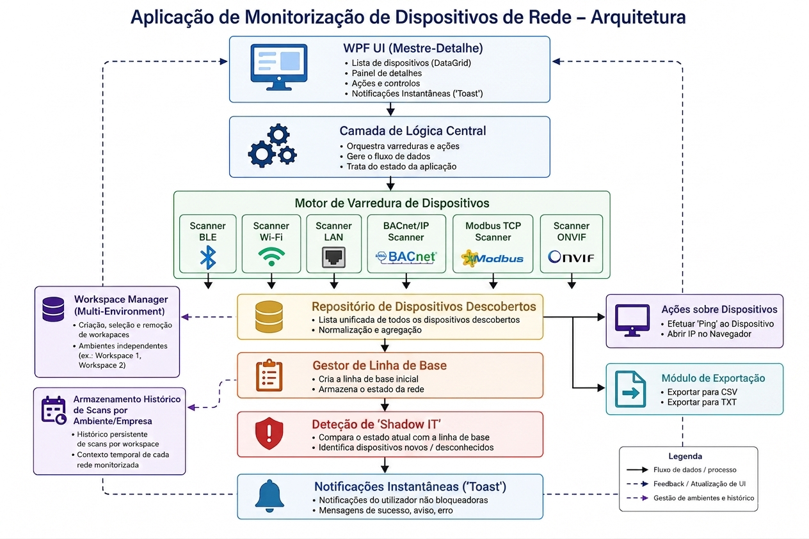

Desktop application developed in C# WPF (.NET) for network discovery, monitoring, asset inventory, and Shadow IT detection across multiple environments.

The platform supports multi-protocol scanning, workspace-based asset management, baseline comparison, historical scan tracking, and real-time monitoring of network devices.

🏗️ Architecture

📌 Description

Modern network environments often contain devices from different vendors, protocols, and technologies. Keeping track of all connected assets and identifying unauthorized devices can be challenging.

Network Device Scanner provides a centralized solution for:

Multi-protocol device discovery
Asset inventory management
Historical scan storage
Workspace-based environment separation
Baseline generation and comparison
Shadow IT detection
Real-time network monitoring
Device interaction and diagnostics

🎯 Problem

Organizations frequently face difficulties in:

Discovering all active devices within the network
Managing multiple customer or company environments
Tracking network changes over time
Detecting unauthorized devices (Shadow IT)
Maintaining an accurate inventory of network assets
Comparing current network states against previous scans

💡 Solution

The application offers:

Multi-protocol network discovery
Workspace management for multiple environments
Persistent historical scan storage
Unified device repository
Baseline generation and comparison
Automatic Shadow IT detection
Device interaction tools
Data export capabilities
Real-time user notifications

🏛️ System Architecture

🖥️ WPF User Interface

The presentation layer follows a Master-Detail approach:

Device list (DataGrid)
Detailed device information panel
User actions and controls
Real-time toast notifications

⚙️ Core Logic Layer

Responsible for:

Coordinating scans
Managing workflows
Processing discovered data
Maintaining application state

🔍 Device Discovery Engine

The scanning engine orchestrates multiple discovery modules:

Supported Protocols
Bluetooth Low Energy (BLE)
Wi-Fi Discovery
LAN Discovery
BACnet/IP
Modbus TCP
ONVIF

Each scanner operates independently and contributes discovered assets to a centralized repository.

📦 Device Repository

Centralized storage layer responsible for:

Aggregating discovered devices
Normalizing device information
Maintaining a unified inventory view
Feeding the UI and analysis modules

📂 Workspace Management

The application supports multiple workspaces, allowing independent monitoring environments.

Features
Create workspaces
Select active workspace
Delete workspaces
Separate inventories per environment
Independent scan history
Example
Workspace 1 → Company A
Workspace 2 → Company B
Workspace 3 → Test Laboratory

This enables multi-environment asset management from a single application.

🕒 Historical Scan Storage

Each workspace maintains a persistent history of scans.

Benefits
Historical device tracking
Environment evolution monitoring
Audit and inventory support
Context preservation between sessions

📋 Baseline Manager

Creates and stores a reference network state.

Functions
Initial baseline creation
Baseline updates
Network state preservation
Comparison against future scans

🚨 Shadow IT Detection

Compares current scan results with the stored baseline.

Detects
New devices
Unknown devices
Unauthorized assets
Network changes

This allows rapid identification of potentially unmanaged devices entering the network.

📡 Device Actions

Direct interaction with discovered assets:

Available Actions
Ping device
Open device IP in browser

Useful for validation, troubleshooting, and quick access.

📤 Export Module

Supports exporting inventory information.

Formats
CSV
TXT

Suitable for reporting and documentation purposes.

🔔 Notification System

Non-blocking toast notifications provide immediate feedback.

Notifications
Success
Warning
Error
Informational events

⚙️ Technologies Used
C#
WPF (.NET)
SQLite
TCP/IP Networking
Bluetooth Low Energy (BLE)
BACnet/IP
Modbus TCP
ONVIF
Async/Await Programming

🚀 Features

🔍 Device Discovery
BLE scanning
Wi-Fi scanning
LAN scanning
BACnet/IP discovery
Modbus TCP discovery
ONVIF discovery

📂 Workspace Management
Multiple environments
Independent inventories
Workspace persistence
Historical context separation

🕒 Historical Scan Tracking
Persistent scan storage
Historical inventory comparison
Environment evolution monitoring

🚨 Shadow IT Detection
Baseline generation
Network comparison
Unauthorized device detection

📡 Device Interaction
Ping devices
Open device management interfaces

📊 Export Capabilities
CSV export
TXT export

🖥️ User Experience
Master-Detail interface
DataGrid visualization
Detailed asset panel
Toast notifications
Responsive asynchronous operations

🧠 Technical Decisions
Asynchronous Architecture

Implemented using async/await to:

Prevent UI blocking
Improve responsiveness
Support concurrent network operations
Modular Scanner Design

Each protocol scanner is implemented independently.

Benefits:

Scalability
Maintainability
Easy integration of new protocols
Workspace-Based Data Isolation

Allows separation of environments while maintaining centralized application management.

Baseline Comparison Strategy

Provides efficient identification of:

New assets
Missing devices
Network changes
Master-Detail Pattern

Improves:

Data visualization
Navigation
User productivity

⚡ Performance
Fully asynchronous operations
Incremental scan processing
Non-blocking UI
Efficient device aggregation
Persistent local storage using SQLite

## 👨‍💻 Author **Gonçalo Cabral ** *Software Development, Networking & Cybersecurity* 
[LinkedIn](https://linkedin.com/in/gonçalo-cabral-016498304) | 
[Portfolio](https://goncalocabral-hub.github.io/goncalocabral.github.io/)
